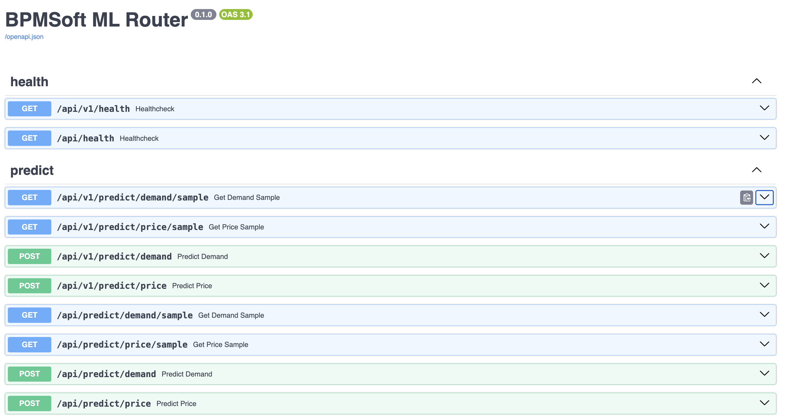
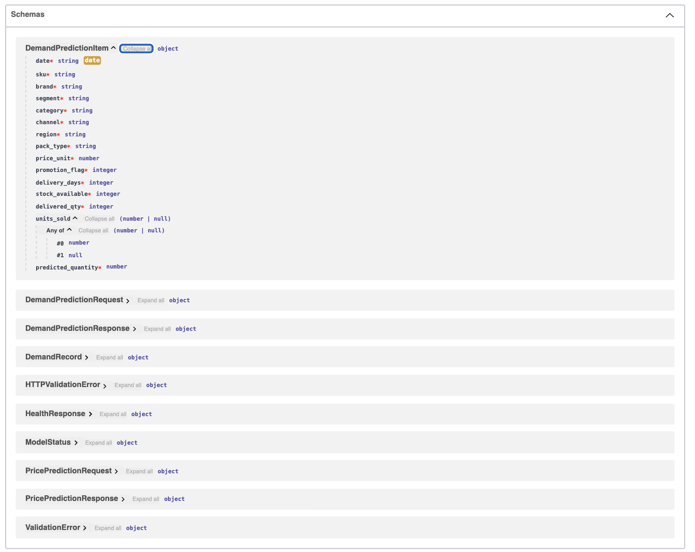
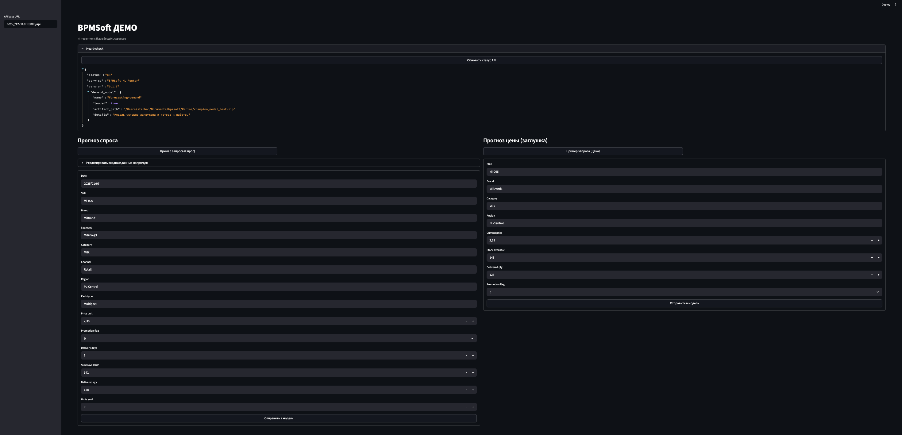
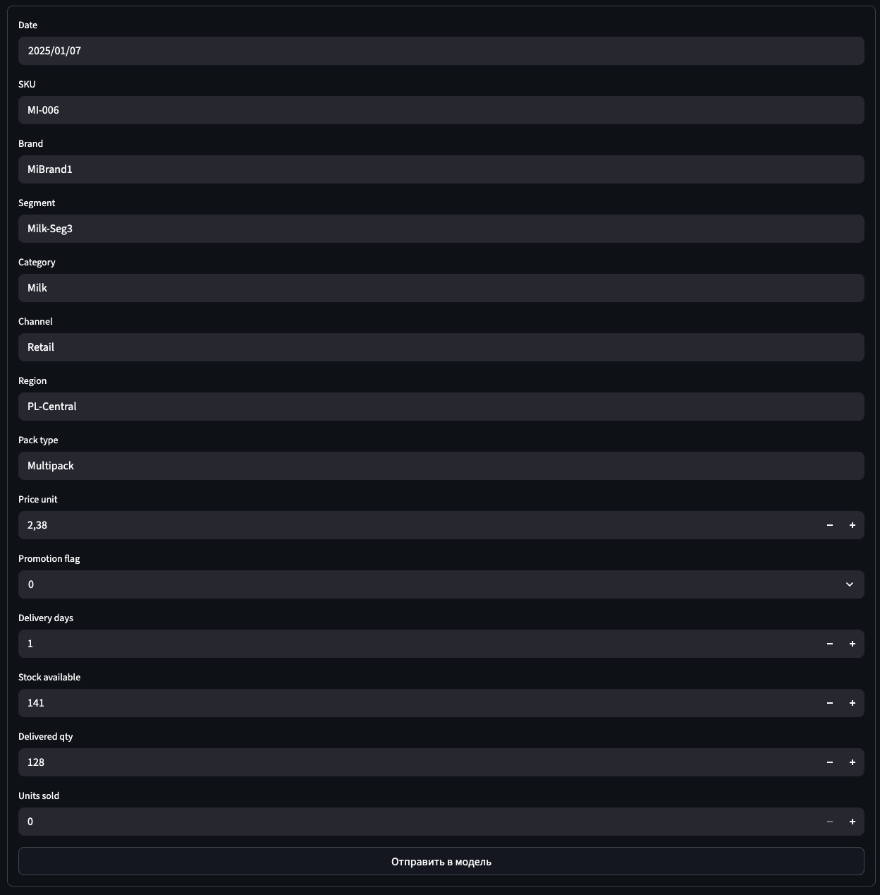
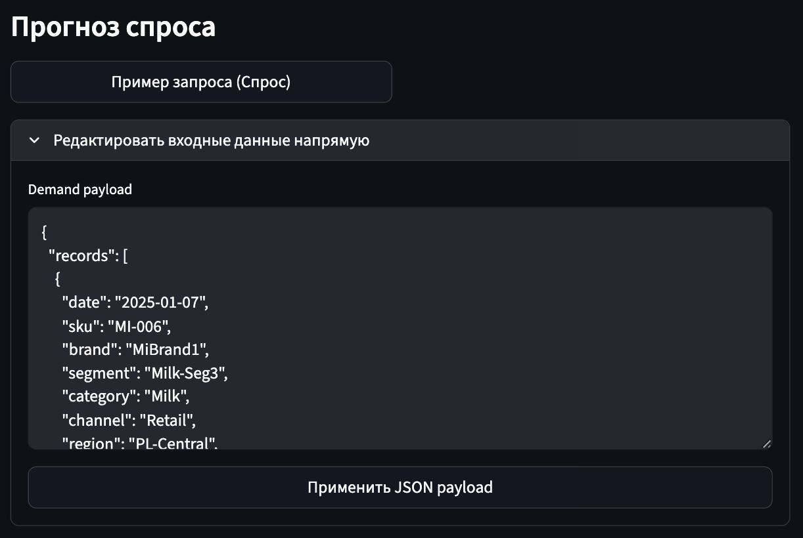
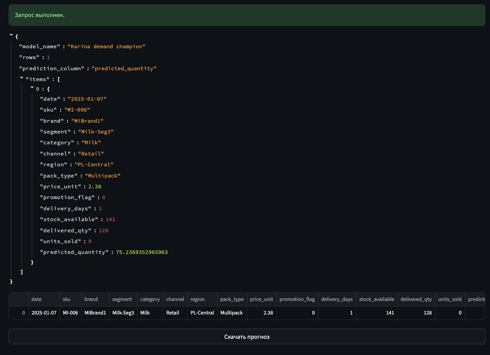
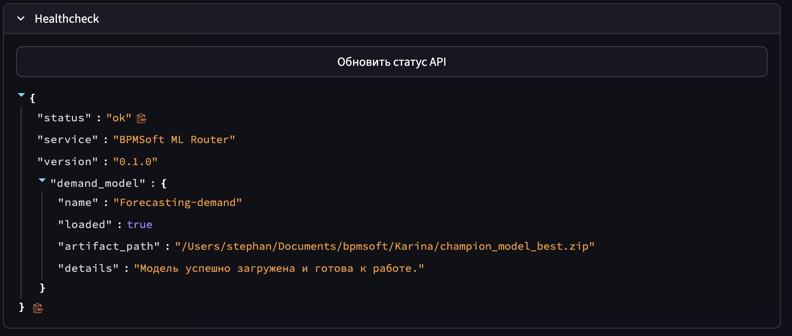
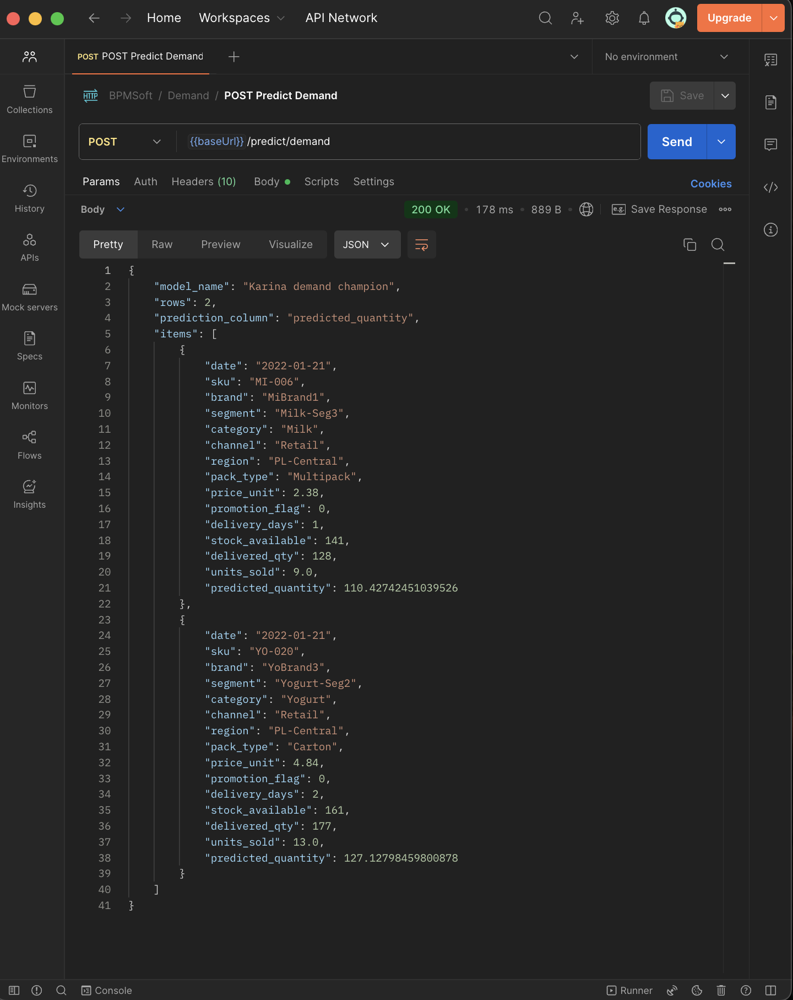

# BPMSoft ML Router

`BPMSoft ML Router` — это единый ML API-шлюз для CRM-системы BPMSoft.  
Сервис принимает REST-запросы от внешней системы, валидирует входные данные, запускает прогнозирование спроса через две demand-модели и возвращает итоговый результат в стабильном интеграционном формате.

В текущей версии проект решает одну бизнес-задачу:
- **прогнозирование спроса**

При этом внутри backend уже работает **AutoML-контур сравнения моделей**:
- **Karina Champion Model** — production-ready demand-модель на `LightGBM + XGBoost`
- **RL Demand v2** — вторая модель спроса на базе `Stable-Baselines3 / PPO`

Роутер умеет:
- запускать обе модели на одном запросе
- возвращать оба прогноза
- выбирать итоговую модель по offline-профилю качества
- показывать аналитику сравнения в Streamlit dashboard

---

## Что умеет сервис

### `POST /api/predict/demand`
Принимает batch-запрос с признаками FMCG-товара и возвращает:
- прогноз модели Карины
- прогноз RL-модели
- итоговый выбранный прогноз
- выбранную модель
- причину маршрутизации

### `GET /api/predict/demand/metrics`
Возвращает offline-метрики RL против baseline:
- overall
- by category
- by segment
- by SKU

### `GET /api/health`
Показывает состояние API и статус загрузки demand-моделей.

### `GET /api/v1/...`
Поддержка versioned API для безопасной эволюции интеграционного контура.

---

## Интерфейс и API

### 1. Swagger UI: маршруты сервиса


### 2. Swagger UI: схемы запросов и ответов


### 3. Главный экран дашборда


### 4. Ручной ввод параметров через форму


### 5. Ручной batch JSON


### 6. Результат прогноза спроса


### 7. Healthcheck API


### 8. Postman: пример запроса


### 9. Offline-сравнение моделей
Эту заглушку стоит заменить скриншотом блока `Сравнение моделей` в Streamlit после запуска сервиса.


---

## Under the Hood

### Единый ML Router
BPMSoft работает не с отдельными моделями напрямую, а с одним backend-шлюзом.  
Это упрощает интеграцию и позволяет развивать ML-часть независимо от внешнего API-контракта.

### Adapter Pattern
Для каждой demand-модели используется отдельный адаптер:
- адаптер модели Карины
- адаптер RL-модели

Адаптер:
- загружает артефакт при старте сервиса
- преобразует входной JSON в нужный формат
- изолирует ML-логику от REST-слоя

### Demand AutoML Router
Над адаптерами работает orchestration-слой, который:
- получает предикт от Karina
- получает предикт от RL
- применяет routing policy
- выбирает итоговый прогноз

### Routing Policy
Выбор модели делается не “на глаз”, а по offline-метрикам на holdout.

Приоритет выбора:
1. `SKU`
2. `segment`
3. `category`
4. `overall`

Если RL показывает устойчивое улучшение baseline по нужному срезу, сервис может выбрать `rl_v2`.  
Если улучшения нет или live RL недоступен, сервис оставляет `karina` как более стабильный champion.

### Enterprise-фичи
- **API versioning**: `/api/...` и `/api/v1/...`
- **Request ID**: каждый запрос трассируется через `X-Request-ID`
- **Structured audit logging**
- **Batch processing**
- **Strict Pydantic validation**
- **Health visibility** по обеим моделям

---

## Технологический стек

**Backend / API**
- `Python 3.11`
- `FastAPI`
- `Pydantic v2`
- `Uvicorn`

**ML**
- `LightGBM`
- `XGBoost`
- `Stable-Baselines3`
- `PPO`
- `scikit-learn`

**Data / Processing**
- `Pandas`
- `NumPy`

**Demo**
- `Streamlit`

**Infra**
- `Docker`
- `Docker Compose`
- `Makefile`
- `.env`
- `pytest`

---

## Артефакты моделей

### Champion model
- `Karina/champion_model_best.zip`

### RL model
Для live RL inference нужны:
- `Backend/artifacts/rl_model/rl_demand_model.zip`
- `Backend/artifacts/rl_model/preprocessor.pkl`

### Offline-метрики
Используются файлы:
- `Backend/artifacts/rl_metrics/metrics_overall.json`
- `Backend/artifacts/rl_metrics/metrics_by_category.csv`
- `Backend/artifacts/rl_metrics/metrics_by_segment.csv`
- `Backend/artifacts/rl_metrics/metrics_by_sku.csv`
- baseline-версии этих же срезов

---

## Структура проекта

```text
Backend/
├── app/
│   ├── api/           # REST routes
│   ├── core/          # config, logging, runtime helpers, audit
│   ├── middleware/    # request id middleware
│   ├── schemas/       # Pydantic contracts
│   └── services/      # adapters, metrics, routing
├── artifacts/
│   ├── rl_metrics/    # offline metrics
│   └── rl_model/      # live RL artifacts
├── dashboard.py       # Streamlit demo
├── postman/           # Postman collection
├── tests/             # API and service tests
├── Dockerfile
├── docker-compose.yml
├── Makefile
├── pyproject.toml
└── requirements.txt
```

---

## Quickstart

### 1. Установить зависимости

Из директории `bpmsoft/Backend`:

```bash
python3.11 -m pip install -r requirements.txt
```

### 2. Подготовить конфигурацию

```bash
cp .env.example .env
```

### 3. Запустить API

```bash
make api
```

После старта:
- API: `http://127.0.0.1:8000`
- Swagger: `http://127.0.0.1:8000/docs`

### 4. Запустить dashboard

Во втором терминале:

```bash
make dashboard
```

После старта:
- Dashboard: `http://127.0.0.1:8501`

---

## Demo Checklist

Перед показом заказчику удобно пройтись по этому сценарию.

### 1. Проверить health

```bash
curl http://127.0.0.1:8000/api/health
```

Что важно увидеть:
- `status = ok`
- `demand_models[0].loaded = true`
- `demand_models[1].loaded = true`

### 2. Открыть Swagger

Открой:

```text
http://127.0.0.1:8000/docs
```

Показать:
- `GET /health`
- `GET /predict/demand/sample`
- `GET /predict/demand/metrics`
- `POST /predict/demand`

### 3. Прогнать sample demand request

```bash
curl -X POST http://127.0.0.1:8000/api/predict/demand \
  -H "Content-Type: application/json" \
  -d '{
    "records": [
      {
        "date": "2025-01-07",
        "sku": "MI-006",
        "brand": "MiBrand1",
        "segment": "Milk-Seg3",
        "category": "Milk",
        "channel": "Retail",
        "region": "PL-Central",
        "pack_type": "Multipack",
        "price_unit": 2.38,
        "promotion_flag": 0,
        "delivery_days": 1,
        "stock_available": 141,
        "delivered_qty": 128,
        "units_sold": 0
      }
    ]
  }'
```

Что важно увидеть:
- `karina_prediction`
- `rl_prediction`
- `predicted_quantity`
- `selected_model`
- `routing_reason`

### 4. Показать dashboard

В dashboard:
- нажать `Пример запроса (Спрос)`
- нажать `Отправить в модель`
- показать итоговый прогноз
- показать отдельные значения Karina и RL
- показать причину выбора модели

### 5. Показать offline-аналитику

В блоке `Сравнение моделей` показать:
- overall-метрики
- сравнение по категориям
- сравнение по сегментам
- сравнение по SKU

---

## Postman

В проекте есть готовая коллекция:

[BPMSoft_ML_Services.postman_collection.json](postman/BPMSoft_ML_Services.postman_collection.json)

Внутри:
- `GET Healthcheck`
- `GET Demand Sample`
- `GET Demand Metrics`
- `POST Predict Demand`

---

## Docker

Если удобнее запускать в контейнере:

```bash
cd bpmsoft/Backend
cp .env.example .env
docker compose up --build
```

После старта:
- API: `http://127.0.0.1:8000/api/health`
- Dashboard: `http://127.0.0.1:8501`

---

## Тесты

```bash
cd bpmsoft/Backend
python3.11 -m pytest tests -q
```

---

## Важные заметки

### macOS / LightGBM
Для локальной загрузки `lightgbm` может понадобиться `libomp`.

### Совместимость RL preprocessor
`preprocessor.pkl` был обучен и сохранён под `scikit-learn 1.6.1`, поэтому в проекте эта версия зафиксирована явно:

- `scikit-learn==1.6.1`

Это нужно, чтобы избежать `InconsistentVersionWarning` и снизить риск несовместимости при live inference.

---

## Итог

Это уже не просто обёртка над одной моделью, а **готовый demand-only AutoML backend для BPMSoft**:
- с production-ready champion-моделью
- со второй RL demand-моделью
- с логикой выбора лучшего кандидата
- с REST API для интеграции
- с dashboard для демонстрации и offline-аналитики
- с базовой enterprise-обвязкой для реального использования
