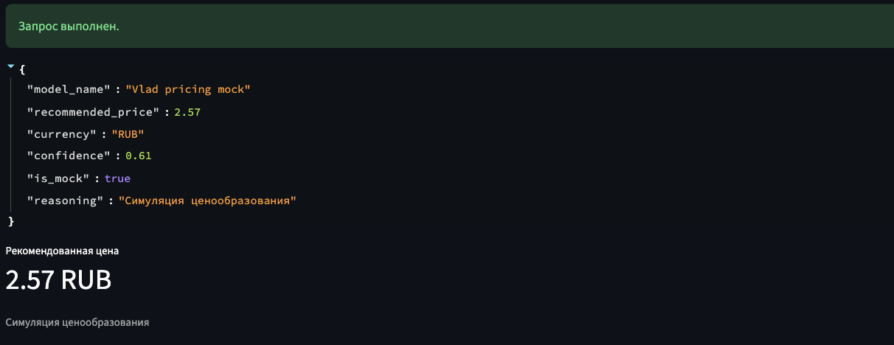

# BPMSoft ML роутер

Единый ML API шлюз для интеграции с CRM **BPMSoft**. 
Проект решает две прикладные задачи внутри одного бэкенда:

- **прогнозирование спроса** на товары
- **симуляция ценообразования** для продуктовых и коммерческих сценариев (модуль пока в разработке)

CRM отправляет запрос, сервис валидирует данные, маршрутизирует их в нужный ML модуль и возвращает результат в стабильном REST формате

---

## Зачем это нужно бизнесу?

Для заказчика этот проект выступает как роутер между CRM и моделями принятия решений

Что это даёт:
- единый интерфейс интеграции для BPMSoft
- быстрый запуск сценария прогноза спроса
- готовый контур под будущую модель ценообразования
- масштабируемую архитектуру, куда можно добавлять новые ML модели без переделки API

Итоговая идея:  
**BPMSoft работает с этим сервисом, а вся ML сложность скрыта внутри него**

---

## Что умеет сервис

### `POST /api/predict/demand`
Принимает batch запрос с товарными и контекстными признаками и возвращает прогноз спроса через модель

### `POST /api/predict/price`
Расчет цены в демонстрационном режиме
Важно: **модуль ценообразования пока находится в разработке**, поэтому здесь используется API заглушка, уже встроенная в общий интеграционный контур

### `GET /api/health`
Показывает состояние API и статус загрузки модели

### `GET /api/v1/...`
Поддержка нескольких версий API для бесшовного обновления системы

---

## Демонстрация интерфейса и API

Ниже собран последовательный демо сценарий:

### 1. REST API: маршруты сервиса


### 2. REST API: схемы запросов и ответов


### 3. Дашборд: главный экран


### 4. Дашборд: ручной ввод через форму


### 5. Дашборд: ручной батч JSON


### Результат прогноза спроса


### Результат симуляции цены
сейчас здесь работает заглушка ценообразования, потому что полноценный модуль ещё в разработке, но API контур и пользовательский сценарий уже готовы



#### Healthcheck (готовность модели)


#### Postman


Полная коллекция для проверки эндпоинтов лежит в проекте

---
### Технологический стек

**Backend / API**
- **Python 3.11**
- **FastAPI**
- **Pydantic v2**
- **Uvicorn**

**ML (модель спроса)**
- **LightGBM**
- **XGBoost**
- веса модели спроса: `Karina/champion_model_best.zip`

**Data / Processing**
- **Pandas**

**Demo**
- **Streamlit**

**Infra**
- **Docker**
- **Docker Compose**
- **Makefile**
- `.env`-конфигурация
- **pytest**

### Архитектурный подход

#### 1. Единый ML роутер
Сервис построен как единая точка входа для ML функциональности BPMSoft.  
CRM не знает, как именно устроены модели внутри. Она работает с одним API контуром, а роутинг, подготовка данных и вызов конкретного ML модуля остаются внутри бэка

#### 2. Адаптация данных
Для инференса спроса используется отдельный адаптер модели. Он:
- загружает артефакт при старте сервиса
- приводит входной JSON к формату, который ожидает модель
- изолирует внутреннюю ML логику от внешнего контракта BPMSoft

Так сделано потому что внешний API контракт и внутренняя схема модели не обязаны совпадать буквально

#### 3. Расширяемая многомодельная архитектура
Архитектура изначально рассчитана на подключение нескольких независимых ML сценариев:
- Модель спроса
- Модель ценообразования 
- В перспективе возможны и другие

---

## Возможности

### Версионирование
Поддерживаются маршруты:
- `/api/...`
- `/api/v1/...`

### Request ID
Каждый запрос получает `X-Request-ID`.  
Если внешний клиент передаёт свой идентификатор, сервис возвращает именно его.

### Логирование
В проект встроены структурированные логи для ключевых операций:
- `healthcheck`
- `predict_demand`
- `predict_price`

### Batch обработка
Эндпоинты прогнощирования поддерживают batch вход, а не только одиночную запись.  
Сделал так, потому что сервис можно использовать в массовых сценариях, пакетных расчётах и демонстрациях на реальных наборах данных

### Валидация
Входные и выходные контракты описаны через Pydantic схемы, поэтому апи:
- предсказуемо валидирует пейлоад
- возвращает стабильную структуру ответа
- хорошо подходит для интеграции с внешними системами

---

## Структура проекта

```text
Backend/
├── app/
│   ├── api/           # REST марштруты
│   ├── core/          # config, logging, errors, audit
│   ├── middleware/    # request id middleware
│   ├── schemas/       # Pydantic contracts
│   └── services/      # model adapters and business services
├── dashboard.py       # демо дашборд на Streamlit
├── postman/           # Постмен коллекция
├── tests/             # API и тесты
├── Dockerfile
├── docker-compose.yml
├── Makefile
└── requirements.txt
```

---

## Как запустить проект

### 1. Установка зависимостей

Выполни следующие команды в bpmsoft/Backend
```bash
python3.11 -m pip install -r requirements.txt
```

### 2. Подготовка конфигурации

```bash
cp .env.example .env
```

### 3. Запустить API

```bash
make api
```

После старта API будет доступен по адресу:

```text
http://127.0.0.1:8000
```

Swagger:

```text
http://127.0.0.1:8000/docs
```

### 4. Запустить дашборд

Во втором терминале, в директории Backend:

```bash
make dashboard
```

Дашборд будет доступен по адресу:

```text
http://127.0.0.1:8501
```

---

## Postman

Для проверки API в проект уже добавлена готовая коллекция:

[BPMSoft_ML_Services.postman_collection.json](postman/BPMSoft_ML_Services.postman_collection.json)

Внутри есть:
- `GET Healthcheck`
- `GET Demand Sample`
- `POST Predict Demand`
- `GET Price Sample`
- `POST Predict Price`

---

## Docker

Если удобнее запускать сервис в контейнере:

```bash
cd bpmsoft/Backend
cp .env.example .env
docker compose up --build
```

После старта:
- API: `http://127.0.0.1:8000/api/health`
- Dashboard: `http://127.0.0.1:8501`

---

## Тесты

```bash
cd bpmsoft/Backend
python3.11 -m pytest tests -q
```

---

## Важная заметка для macOS

Для локальной загрузки `lightgbm` может понадобиться `libomp`

---

## Итог

Это готовый интеграционный ML бэкенд для BPMSoft:
- с продакшн прогнозом спроса
- с подготовленным контуром под сценарий ценообразования
- с понятным REST API
- с дашбордом для демо
- с масштабируемой архитектурой
